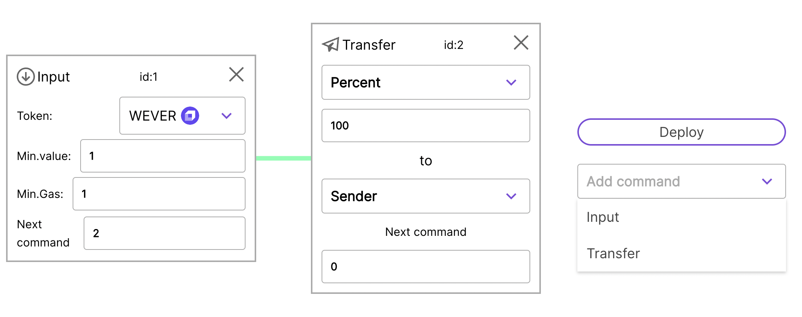
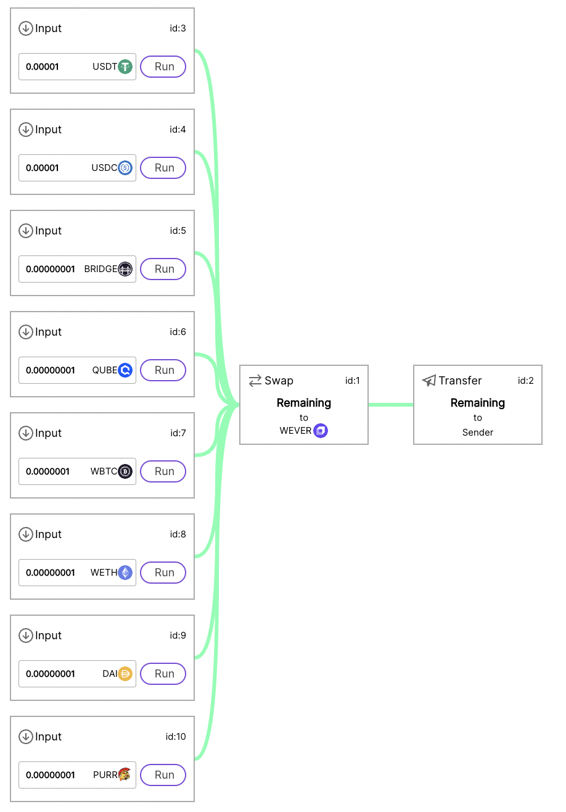
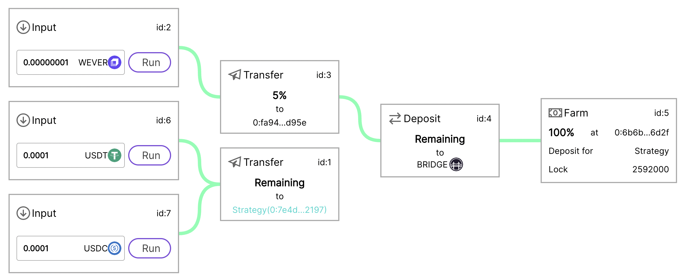

# Strategy Builder

Project Github: https://github.com/tonred/StrategyBuilder

MainNet Strategy Builder: `0:bfa6edc24504f7e40904c8e8d9a942bd385b256a78f0f45000ca7b61016014bf`

UI Viewer and Builder: [https://strategy-builder-front.pages.dev](https://strategy-builder-front.pages.dev)

TG: @Abionics, @get_username

## Key features:
* Easy to build using ready components
* Flexible configuration
* Auto-setup wallets and utils in Strategy
* User-friendly UI builder
* Ability to extend builder with new commands


## Technical description

### Abstract

Project contains two contract types: Strategy and StrategyBuilder.
StrategyBuilder is used for Strategy creation and validation.
Strategy is the main entity which contains all info about workflow,
token inputs, wallets etc

Strategy workflow is described as DAG ([Directed Acyclic Graph](https://en.wikipedia.org/wiki/Directed_acyclic_graph))
where roots (inputs) is a token inputs. There is a sample with 2 inputs (USDT/USDC)

Every leaf (block) in DAG tree is a separate command, see [Command](#Command) for details.
In addition, inputs have additional hash mapping in order to detect different tokens as different inputs,
see [Input](#Input) for details.

### Command

Every command contains:
* Command kind (see [Supported commands](#Supported-Commands))
* Specific command params
* [optional] ID of child command that will be executed in callback of current command (for example, transfer **after** swap)
* [optional] ID of next command that will be executed next in this transaction (for example, 2 swaps **in a row**)

### Supported Commands

| kind       | childID | description and params                                                                                                  | code                                                    |
|------------|---------|-------------------------------------------------------------------------------------------------------------------------|---------------------------------------------------------|
| `NOTHING`  | -       | Empty command, can be used for empty callback (exit) or as a mock in `TokenInput`                                       | -                                                       |
| `TRANSFER` | -       | Transfer TIP3 token to recipient <br> **Params:** amount, recipient, isDeployWallet, payload, value (send), flag (send) | [Transfer.sol](contracts/commands/actions/Transfer.sol) |
| `SWAP`     | +       | Swap token in pair <br> **Params:** to (token root), amount, value (send), flag (send)                                  | [Swap.sol](contracts/commands/actions/Swap.sol)         |
| `DEPOSIT`  | +       | Deposit liquidity to pool <br> **Params:** second (token root), amount, lp (token root), value (send), flag (send)      | [Deposit.sol](contracts/commands/actions/Deposit.sol)   |
| `FARM`     | -       | Deposit lp tokens to farming <br> **Params:** amount, farm, depositOwner, lockTime, value (send), flag (send)           | [Farm.sol](contracts/commands/actions/Farm.sol)         |

**Strategy can be connected to each other.** This can be done via just sending tokens
to an address of another strategy (and accepting callback token(s) as inputs if needed).
See more in [Sample Strategies](#Sample-Strategies)

All commands source code files have more details in headers.
New command type can be easily added to Strategy, because all commands have similar interface.
Examples of commands that we did not implemented due to lack of time:
* Wrap ever to wever (see template in [unused/Wrap.sol](contracts/commands/actions/unused/Wrap.sol))
* Unwrap wever to ever (see template in [unused/Unwrap.sol](contracts/commands/actions/unused/Unwrap.sol))
* Send tokens via Octus Bridge

### Input

In order to detect different token inputs, every input has unique hash. This hash contains from
token input kind, token root address and allowed sender address (use `AddressExtendedKind.SENDER` kind for any sender).
Currently supported token input kinds:
* `InputKind.TOKEN` - on TIP3.2 token input
* `InputKind.RECEIVE` - on evers receiving
* `InputKind.TRIGGER` - on calling `Strategy.trigger()` method via internal message

The most useful token input kinds is a `InputKind.TOKEN`

## Additional Functions

Each Strategy has set of methods that can be called only by owner. It is:
* `drain` - drain redundant evers
* `withdraw(token, amount, force)` - withdraw TIP3.2 token from Strategy wallet.
Force used in order to skip balance checks in contract (in case of unexpected balance)
* `claim(gauge, callID, nonce)` - claim reward from Strategy account in Gauge farming
* `changeOwner(newOwner` - change owner of Strategy


## Deploy

### Requirements

* [locklift](https://www.npmjs.com/package/locklift) `1.5.3`
* [everdev](https://github.com/tonlabs/everdev) with compiler `0.63.0`, linker `0.15.70`
* python `3.10`
* nodejs

### Deploy

```shell
# 1) Setup
npm run setup
```

```shell
# 2) Build
npm run build
```

```shell
# 3) Deploy
npm run deploy-builder
```


## UI and Tools

There is UI for viewing and building strategies.
You can insert any created strategy in [https://strategy-builder-front.pages.dev](https://strategy-builder-front.pages.dev)
and view it DAG. Moreover, you can execute any strategy directly from UI

Currently, builder (UI) support only 2 commands and input. So we created some ready Strategies,
check them in [Sample Strategies](#Sample-Strategies)


Besides, there is simple Python tool for strategy building in [tools/strategy](tools/strategy).
Dot forget to install [requirements.txt](tools/requirements.txt) before.
It already contains 5 sample strategy, that is describes in [Sample Strategies](#Sample-Strategies)


## Sample Strategies

### Swap WEVER to USDT

MainNet address: `0:2ddef82f0bd07ea5013c35f3fde096e3580cba2d9c157d1d241e5725345e654b`

UI viewer link: [https://strategy-builder-front.pages.dev/strategy/0:2ddef82f0bd07ea5013c35f3fde096e3580cba2d9c157d1d241e5725345e654b](https://strategy-builder-front.pages.dev/strategy/0:2ddef82f0bd07ea5013c35f3fde096e3580cba2d9c157d1d241e5725345e654b)


This is a simple Strategy that swap any amount WEVER to USDT and send them back to sender.
It is a pipeline _"receive token + swap a preconfigured portion of them + optionally send to preconfigured recipient address"_ from challenge

### Swap to 3 stables

MainNet address: `0:0f73fe08390eae7071dc091bdbafb7b456e347688e1ca64d94c8503f77199605`

UI viewer link: [https://strategy-builder-front.pages.dev/strategy/0:0f73fe08390eae7071dc091bdbafb7b456e347688e1ca64d94c8503f77199605](https://strategy-builder-front.pages.dev/strategy/0:0f73fe08390eae7071dc091bdbafb7b456e347688e1ca64d94c8503f77199605)


This Strategy swap any amount WEVER to USDT + USDC + DAI in equal proportion (33.3%).
It is a pipeline _"receive token + swap to multiple tokens according to configuration + withdraw method"_ from challenge.
By the way, withdraw method is also implemented, see [Additional Functions](#Additional-Functions)

### Deposit and farm

MainNet address: `0:11c828b1c4ff5dd05e352ec1596c8b4c04ebdcfeb9aefa25043f9a1bbf2a7022`

UI viewer link: [https://strategy-builder-front.pages.dev/strategy/0:11c828b1c4ff5dd05e352ec1596c8b4c04ebdcfeb9aefa25043f9a1bbf2a7022](https://strategy-builder-front.pages.dev/strategy/0:11c828b1c4ff5dd05e352ec1596c8b4c04ebdcfeb9aefa25043f9a1bbf2a7022)


This Strategy add user WEVER to WEVER-USDT pool and lock lp in farm. **Owner of locked lp and reward is sender.**
Besides, this Strategy take 5% fee that sends to Strategy owner balance. 
It is a pipeline _"receive token + swap in 50/50 proportion + provide liquidity to pool + receive LP + lock LP into farming pool + claim rewards method with optional recipient address"_ from challenge.

### Any to WEVER

MainNet address: `0:7e4d84423acf3121b42113d669fc87be010ff3926d0ba007874663e53a912197`

UI viewer link: [https://strategy-builder-front.pages.dev/strategy/0:7e4d84423acf3121b42113d669fc87be010ff3926d0ba007874663e53a912197](https://strategy-builder-front.pages.dev/strategy/0:7e4d84423acf3121b42113d669fc87be010ff3926d0ba007874663e53a912197)


This Strategy swaps any token from USDT/USDC/BRIDGE/QUBE/WBTC/WETH/DAI/PURR to WEVER and
sends them to sender. Very useful Strategy that can be user as a part of another Strategy (see next sample)

### Fill pool

MainNet address: `0:25b53ba5ebc425afabff4c5d9dd0772c5a03b838d8d364ab1c25bf57a5fd8d25`

UI viewer link: [https://strategy-builder-front.pages.dev/strategy/0:25b53ba5ebc425afabff4c5d9dd0772c5a03b838d8d364ab1c25bf57a5fd8d25](https://strategy-builder-front.pages.dev/strategy/0:25b53ba5ebc425afabff4c5d9dd0772c5a03b838d8d364ab1c25bf57a5fd8d25)


This Strategy swaps USDT/USDC to WEVER, send them to pool WEVER-BRIDGE and lock lp in farm.
This is a sample how one Strategy can use another. The owner of lp and reward is Strategy. If owner
wants to claim reward, he can call `claim` method in Strategy (see [Additional Functions](#Additional-Functions)).
This Strategy can be used for autofill pool from, where incoming tokens is some commissions in some service


## Use Cases

### Users

This Strategy Builder can be used by users to create custom Strategy for their needs.
It can be a deposit to farm in one transaction (instead of long way deposit+farm in UI),
or automatic tool for diversification token into 3 stables in equal proportion

### Services

This Strategy Builder is very useful for onchain operations. Instead of writing custom code
for basic operations, service can deploy Strategy and use it. There is some examples:
* Auto burn tokens (swap to wever, unwrap and send to black hole) - can be used in DeNS and EverStart
* Swapping TIP3 tokens for gas - can be used in Adaever and maybe in Bridge
* [Swapping any token to WEVER](#Any-to-WEVER) - can be used in launchpads like EverStart
